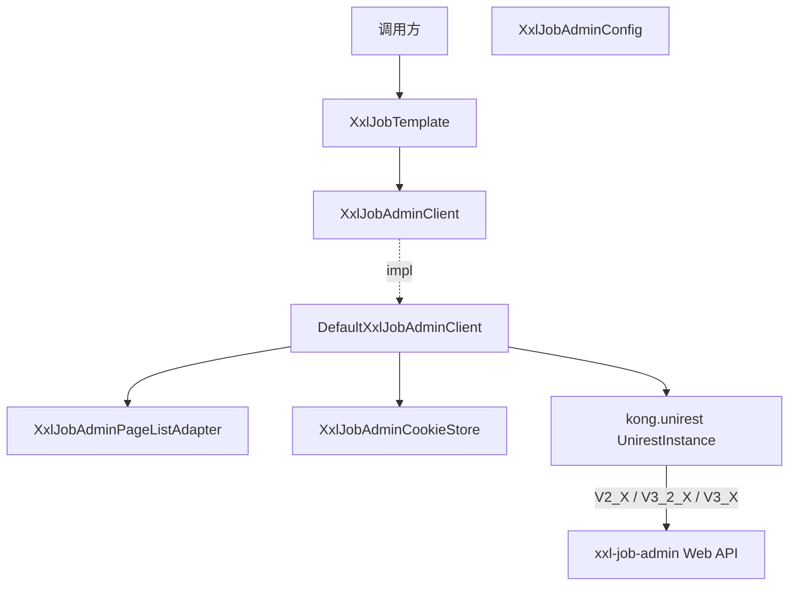

# xxljob-extension

基于 XXL-Job admin Web API 的纯 Java 扩展库，统一版本感知调用、Cookie 容错管理与多版本协议兼容。

本项目是独立 XXL-Job 扩展，不绑定 Spring Boot、Javalin、Quarkus 或 DDD4J；按需选择 `core`（纯 Java）或 `spring`（Spring Framework 集成）。

## 能力

- admin HTTP 客户端：基于 Unirest 的统一调用，禁用 Unirest 内置 Cookie 管理改为手工解析。
- 多版本协议适配：V2_X（2.x/3.0/3.1）、V3_2_X（3.2 混合）、V3_X（3.3+ 完整 V3）路径与参数自动切换。
- Cookie 容错：规避 Apache HttpClient 对 remember-me 无效 `Expires` 的严格校验，避免被 302 重定向到登录页。
- 会话自愈：session 过期（302 或 HTML 登录页）自动重登并重试一次，业务无感。
- 业务门面：`XxlJobTemplate` 覆盖登录、执行器组 CRUD、任务 CRUD、start/stop/trigger、防重添加。
- 执行器扩展：`@XxlJobCron` 注解（100% 替代 `@XxlJob`，可与 `@XxlJob` 组合），跨版本反射注册 `JobHandler`。
- Micrometer 集成（spring 模块）：提供 `MetricMethodJobHandler` 与 `XxlJobMetrics`（回调队列指标），自动适配 spring-boot-actuator。
- JDK 8 / 17 / 21：三条 feature 分支分别构建。

## Maven

按需引入其中一个或两个模块：

```xml
<!-- 纯 Java：HTTP 客户端、模板、模型、注解、工具 -->
<dependency>
    <groupId>io.github.hiwepy</groupId>
    <artifactId>xxljob-extension-core</artifactId>
    <version>1.0.x.20260630-SNAPSHOT</version>
</dependency>

<!-- Spring Framework 集成：执行器自动绑定、Micrometer 指标 -->
<dependency>
    <groupId>io.github.hiwepy</groupId>
    <artifactId>xxljob-extension-spring</artifactId>
    <version>1.0.x.20260630-SNAPSHOT</version>
</dependency>
```

`core` 不依赖 Spring；`spring` 传递依赖 `core`。

## 快速开始

### 初始化 admin 客户端

```java
UnirestInstance unirest = Unirest.spawnInstance();
unirest.config()
       .connectTimeout(10_000)
       // 关闭内置 Cookie，规避无效 Expires 解析失败
       .enableCookieManagement(false)
       // 不跟随 302，便于 postForm 识别未登录并重试登录
       .followRedirects(false);

XxlJobAdminConfig config = XxlJobAdminConfig.builder()
        .addresses("http://localhost:8080/xxl-job-admin")
        .username("admin")
        .password("123456")
        .version(AdminVersion.V3_X)
        .build();

XxlJobAdminClient client = new DefaultXxlJobAdminClient(unirest, config);
XxlJobTemplate template = new XxlJobTemplate(client);
```

### 登录

```java
ReturnT<String> login = template.login("admin", "123456", false);
if (login.getCode() == ReturnT.SUCCESS_CODE) {
    // 会话 Cookie 已缓存在 XxlJobAdminCookieStore，后续 postForm 透明携带
}
```

### 执行器组 CRUD

```java
XxlJobGroup group = new XxlJobGroup();
group.setAppName("my-executor");
group.setTitle("My Executor");
group.setAddressType(0);

ReturnT<String> add = template.addJobGroup(group);
Integer groupId = Integer.valueOf(add.getContent());

ReturnT<XxlJobGroupList> page = template.jobInfoGroupList(0, 10, "my-executor", null);
```

### 任务 CRUD 与启动

```java
XxlJobInfo job = new XxlJobInfo();
job.setJobGroup(groupId);
job.setJobDesc("daily-job");
job.setAuthor("ops");
job.setScheduleType(ScheduleTypeEnum.CRON.name());
job.setScheduleConf("0 0 3 * * ?");
job.setGlueType("BEAN");
job.setExecutorHandler("demoJobHandler");
job.setExecutorRouteStrategy(ExecutorRouteStrategyEnum.LEAST_FREQUENTLY_USED.name());

ReturnT<String> addJob = template.addJob(job);
// addUniqueJob 会先按 jobDesc 去重再决定新增
// ReturnT<String> addJob = template.addUniqueJob(job);

Integer jobId = Integer.valueOf(addJob.getContent());

template.startJob(jobId);   // V2/V3_2 走 id；V3 走 ids[]
template.stopJob(jobId);
template.triggerJob(jobId, "{\"foo\":\"bar\"}");
```

### Session 过期自愈

`DefaultXxlJobAdminClient.postForm` 内部检测：响应 302 或内容为 HTML 登录页（非 JSON）时，自动重置会话、重新登录、重试一次，无需在业务代码中处理。

### 使用 `@XxlJobCron` 自动绑定

`spring` 模块提供 `XxlJobAutoBindingSpringExecutor`，启动时扫描 `@Component` Bean 中的 `@XxlJob` 与 `@XxlJobCron` 方法，注册到执行器并按 cron 元数据自动登录 admin 创建/更新任务：

```java
@Component
public class MyJobs {

    @XxlJobCron(value = "demoJobHandler", cron = "0/10 * * * * ?",
                desc = "示例", author = "ops")
    public void demo() {
        XxlJobHelper.log("hello from demo");
    }
}
```

可选启用 micrometer 监控：替换 `XxlJobAutoBindingSpringExecutor` 为 `XxlJobAutoBindingAndMetricsSpringExecutor`，handler 会自动接入 `MeterRegistry`。

## 架构



## 主要结构

```text
io.github.hiwepy
├── xxljob-extension-core
│   ├── AdminVersion              # V2_X / V3_2_X / V3_X
│   ├── XxlJobConstants           # 公共路径 + 版本差异路径表
│   ├── XxlJobTemplate            # 业务门面
│   ├── config/XxlJobAdminConfig  # 解耦的轻量配置
│   ├── admin/                    # 客户端接口/实现/Cookie/响应/分页适配
│   ├── annotation/XxlJobCron
│   ├── executor/                 # 路由、misfire、调度类型、周期枚举
│   ├── model/                    # ReturnT、XxlJobInfo、XxlJobGroup
│   └── util/                     # XxlJobHandlerRegistrar、XxlJobHelper
└── xxljob-extension-spring
    ├── XxlJobAutoBindingSpringExecutor              # 启动扫描 @XxlJob + @XxlJobCron
    ├── XxlJobAutoBindingAndMetricsSpringExecutor    # + micrometer 包装
    └── metrics/
        ├── MetricNames
        ├── MetricMethodJobHandler
        └── XxlJobMetrics             # 回调队列指标
```

## 多版本兼容

`AdminVersion` 按 HTTP 路径版本号选择，不绑定 admin 的 Maven 版本：

| `AdminVersion` | 对应 admin | 登录路径 | CRUD 路径 | 任务删除路径 | 主键参数 | 分页参数 | Cookie 名 |
|---|---|---|---|---|---|---|---|
| `V2_X`（默认） | 2.x、3.0.0、3.1.x | `/login` | `save` / `add` / `remove` | `/jobinfo/remove` | `id` | `start` / `length` | `XXL_JOB_LOGIN_IDENTITY` |
| `V3_2_X` | 3.2.0 混合 | `/auth/doLogin` | `save` / `add` / `remove` | `/jobinfo/remove` | `id` | `start` / `length` | `xxl_job_login_token` |
| `V3_X` | 3.3.0+ 完整 V3 | `/auth/doLogin` | `insert` / `delete` | `/jobinfo/delete` | `ids[]` | `offset` / `pagesize` | `xxl_job_login_token` |

调用方仅需在 `XxlJobAdminConfig` 中显式指定 `version`（默认 `V2_X`）；其余调用同一套 API。

## 输入与输出

`XxlJobTemplate` 业务 API 一览：

| 分组 | 方法 | 返回类型 |
|---|---|---|
| 认证 | `login`、`logout` | `ReturnT<String>` |
| 执行器组 | `jobInfoGroupList`、`jobInfoGroup`、`addJobGroup`、`updateJobGroup`、`removeJobGroup` | `ReturnT<XxlJobGroupList>` / `ReturnT<XxlJobGroup>` / `ReturnT<String>` |
| 任务 | `jobInfoList`、`addJob`、`addUniqueJob`、`updateJob`、`removeJob` | `ReturnT<XxlJobInfoList>` / `ReturnT<String>` |
| 任务控制 | `startJob`、`stopJob`、`triggerJob` | `ReturnT<String>` |
| 客户端 | `version`、`isV3`、`loginIfNeeded`、`postForm`、`buildUrl` | 客户端接口方法 |

`ReturnT<T>` 字段：`code`（`SUCCESS_CODE=200` / `FAIL_CODE=500`）、`msg`、`content`（业务数据，任意类型）。

设计约束：

- `core` 模块不依赖任何 Spring 类，便于无 Spring 环境复用；`enforcer` 构建期强制禁止 Spring 依赖混入库。
- `DefaultXxlJobAdminClient` 的 Cookie 由 `XxlJobAdminCookieStore` 手工管理，仅取 `name=value`，忽略 `Expires`/`Max-Age` 等可能无效的属性。
- `XxlJobHandlerRegistrar.registerJobHandler` 通过反射依次尝试 `registJobHandler` / `registryJobHandler` 方法名（兼容 xxl-job-core 2.5~3.4+）。
- 异常一律映射为 `ReturnT.FAIL_CODE` + 错误描述，调用方无需捕获受检异常。

## 构建验证

```bash
./mvnw clean test            # 在仓库根目录同时构建 core 与 spring 模块
./mvnw -pl xxljob-extension-spring test   # 仅跑 spring 模块测试（含 Mock server 多版本集成测试）
```

`spring` 模块默认 JDK 8 基线（1.0.x 分支）；`2.0.x` 分支适配 JDK 17，`3.0.x` 分支适配 JDK 21。

## License

Apache License 2.0。
